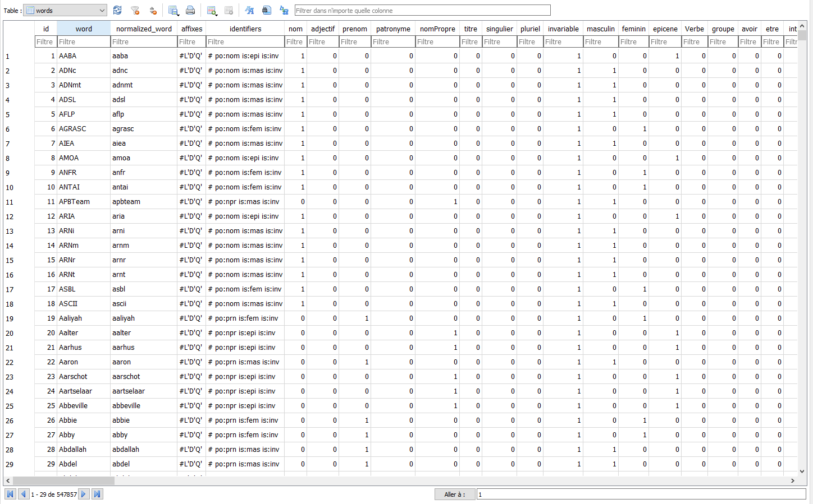
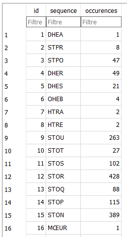

# SQLiteGenerator

This is a project allowing to build a SQLite database containing words and sequences from a Hunspell dictionary.

For now, it is hardcoded to use the french dictionary from [Grammalecte](https://grammalecte.net/) (license MPL 2.0).

## Words

The database contains a list of words, and their characteristics. Not all words are present, I've made it for the word guessing games I am working on, like [word-guessing-solo](https://github.com/isirode/word-guessing-solo), so they are filtered by size, for instance.

Also, not all combinations are generated, prefix like "l'" are not included, for instance.

## Sequences

The app is generating a list of sequences, that compose the words, of a predefined size  (4).

Such as (if it was english):

- hell
- ello
- worl
- orld
- gene
- ener
- nera
- erat
- rati
- ating

Or, in french:
- bien
- venu

## LICENSE (database)

The database is licensed under the Mozilla Public License 2.0.

## LICENSE (code base)

It is provided with the GNU AFFERO GENERAL PUBLIC LICENSE.

This is a project allowing to build a SQLite database containing words and sequences from a Hunspell dictionary.

Copyright (C) 2023  Isirode

This program is free software: you can redistribute it and/or modify
it under the terms of the GNU Affero General Public License as
published by the Free Software Foundation, either version 3 of the
License, or (at your option) any later version.

This program is distributed in the hope that it will be useful,
but WITHOUT ANY WARRANTY; without even the implied warranty of
MERCHANTABILITY or FITNESS FOR A PARTICULAR PURPOSE.  See the
GNU Affero General Public License for more details.

You should have received a copy of the GNU Affero General Public License
along with this program.  If not, see <https://www.gnu.org/licenses/>.
